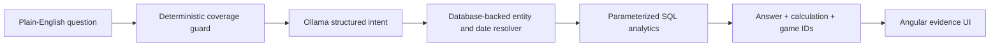

# ArcLine · NBA Evidence Lab

[](https://github.com/Nico71113/nba-rockets-ai-analytics/actions/workflows/ci.yml)

An explainable, local-first NBA analytics assistant built around the Houston
Rockets and Kevin Durant. Ask a supported question in plain English and the app
returns the exact database result, calculation method, interpreted filters, and
supporting game IDs. When the snapshot cannot support a claim, the app explains
which data is missing instead of guessing.

## What this project demonstrates

- A reproducible pipeline that downloads, normalizes, and validates a fixed
  2025–26 snapshot covering all 30 NBA teams.
- A typed PostgreSQL schema with Alembic migrations and cross-table integrity
  constraints.
- A local Ollama model used only for structured intent classification—never for
  arithmetic or arbitrary SQL generation.
- Parameterized analytics functions for records, player summaries, threshold
  splits, game results, and source-provided availability notes.
- An Angular evidence interface with explicit calculations, filters, data
  coverage, and refusals.
- Synthetic golden evaluations plus full-snapshot integrity checks.

## How answers are produced



The model selects one of a small set of typed intents. Application code then
resolves players, teams, and dates against the loaded database and runs a tested
analytics function. This boundary keeps numerical results deterministic and
makes model mistakes visible rather than silently turning them into facts.

## Supported questions

- Team record over a season, month, or explicit date range.
- Player totals and per-game averages.
- Team record when a player reaches a box-score threshold.
- Final score and winner for a dated matchup.
- Whether a player appeared in a game and any source-provided availability
  comment.

The system deliberately refuses live scores, predictions, defensive matchups,
player tracking, and video/off-ball analysis because those fields are not in
the snapshot.

## Verified snapshot

| Coverage | Rows |
| --- | ---: |
| Games, all included competition types | 1,322 |
| Regular-season games | 1,230 |
| Teams | 30 |
| Players | 591 |
| Team-game rows | 2,644 |
| Player-game rows | 34,787 |
| Rockets regular-season games | 82 |
| Kevin Durant/Rockets regular-season rows | 78 |

Source: Kaggle dataset
[`eoinamoore/historical-nba-data-and-player-box-scores`](https://www.kaggle.com/datasets/eoinamoore/historical-nba-data-and-player-box-scores),
version 515. See [`docs/DATA_SOURCES.md`](docs/DATA_SOURCES.md) for provenance,
license, checksums, and distribution decisions.

## Run locally

Prerequisites: Docker Desktop, Ollama, Python 3.11+, and about 1 GB of free
space. The source download is roughly 420 MB and is not committed to Git.

```bash
git clone https://github.com/Nico71113/nba-rockets-ai-analytics.git
cd nba-rockets-ai-analytics
cp .env.example .env

ollama pull qwen3.5:2b
make install
make data
docker compose up -d db
make data-load
make up
```

Open:

- App: <http://localhost:4300>
- API documentation: <http://localhost:8100/docs>
- PostgreSQL: `localhost:55432`

These ports are intentionally non-default so the project can run beside other
local applications. Stop the stack with `make down`.

## Verify

```bash
make verify
```

The current suite contains 42 Python tests and 2 Angular tests. The Python
suite includes a hand-checkable synthetic snapshot and, when local normalized
files exist, integrity checks against the full data snapshot. The frontend
verification also runs a production build; `npm audit` reports zero known
vulnerabilities at the time of this commit.

## Repository data policy

Raw and normalized third-party rows remain local and are ignored by Git. The
repository contains only download/transformation code, a checksum manifest,
schemas, tests, documentation, and a small synthetic fixture. The large
play-by-play file is intentionally outside the current product scope; adding a
separately evaluated video/tracking or retrieval layer is a future extension,
not a capability claimed by this version.

## Independence

This is an original clean-room portfolio project. It contains no code, data,
questions, prompts, or submission artifacts from a private technical
assessment. It is not affiliated with or endorsed by the NBA, the Houston
Rockets, or their partners, and it uses no official team logos.
