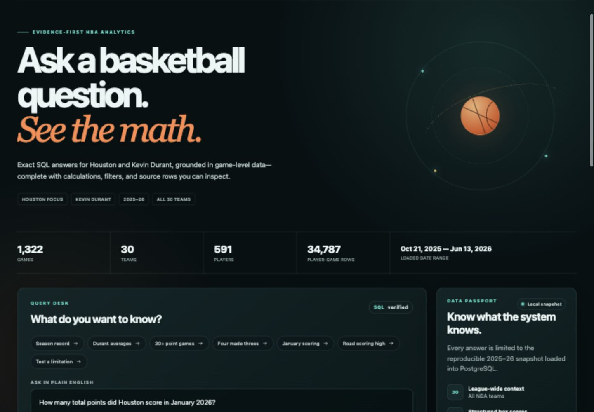
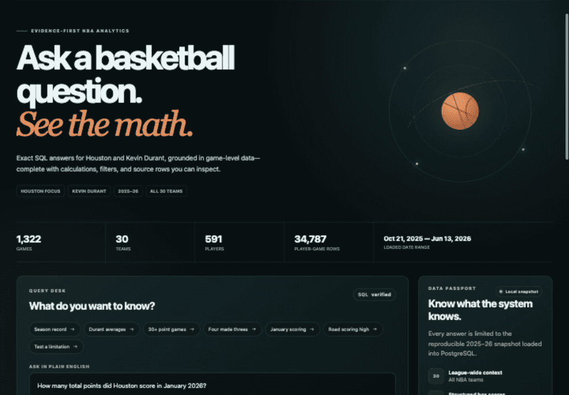
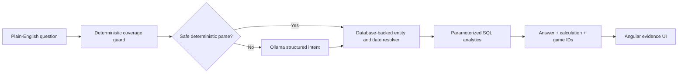
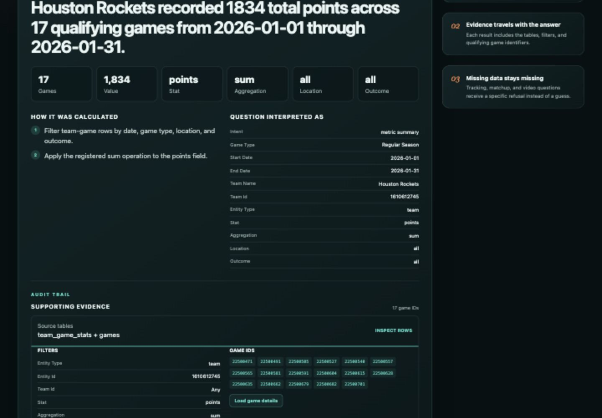

# ArcLine · NBA Evidence Lab

[](https://github.com/Nico71113/nba-rockets-ai-analytics/actions/workflows/ci.yml)

An explainable, local-first NBA analytics assistant built around the Houston
Rockets and Kevin Durant. Ask a supported question in plain English and the app
returns the exact database result, calculation method, interpreted filters, and
supporting game IDs. When the snapshot cannot support a claim, the app explains
which data is missing instead of guessing.



Try questions such as:

- “How many total points did Houston score in January 2026?”
- “What was Houston's record when Kevin Durant scored at least 30 points?”
- “What was Kevin Durant's highest road scoring game?”

### 30-second walkthrough



## What this project demonstrates

- A reproducible pipeline that downloads, normalizes, and validates a fixed
  2025–26 snapshot covering all 30 NBA teams.
- A typed PostgreSQL schema with Alembic migrations and cross-table integrity
  constraints.
- A local Ollama model used only for structured intent classification—never for
  arithmetic or arbitrary SQL generation.
- A hybrid router: high-confidence common questions use a fast deterministic
  parser, while ambiguous supported wording can use the local model.
- Parameterized analytics functions for records, player summaries, composable
  totals/averages/highs/lows, home/away and win/loss splits, threshold splits,
  game results, and source-provided availability notes.
- An Angular evidence interface with explicit calculations, filters, data
  coverage, specific refusals, row-level game details, and CSV export.
- Exact numerical golden evaluations, a 100-question language suite,
  full-snapshot integrity checks, browser/mobile/accessibility tests, Lighthouse
  budgets, and a Docker end-to-end CI smoke test.

## How answers are produced



The router selects one of a small set of typed intents. Common, unambiguous
questions are parsed deterministically; other supported wording can use the
local model. Application code then resolves players, teams, and dates against
the loaded database and runs a tested analytics function. This boundary keeps
numerical results deterministic and makes routing mistakes visible rather than
silently turning them into facts.



## Supported questions

- Team record over a season, month, or explicit date range.
- Player totals and per-game averages.
- Registered player or team statistics using total, average, maximum, or
  minimum, optionally split by home/away and wins/losses.
- Team record when a player reaches a box-score threshold.
- Final score and winner for a dated matchup.
- Whether a player appeared in a game and any source-provided availability
  comment.

The system deliberately refuses live scores, predictions, defensive matchups,
player tracking, and video/off-ball analysis because those fields are not in
the snapshot.

## Verified snapshot

| Coverage | Rows |
| --- | ---: |
| Games, all included competition types | 1,322 |
| Regular-season games | 1,230 |
| Teams | 30 |
| Players | 591 |
| Team-game rows | 2,644 |
| Player-game rows | 34,787 |
| Rockets regular-season games | 82 |
| Kevin Durant/Rockets regular-season rows | 78 |

Source: Kaggle dataset
[`eoinamoore/historical-nba-data-and-player-box-scores`](https://www.kaggle.com/datasets/eoinamoore/historical-nba-data-and-player-box-scores),
version 515. See [`docs/DATA_SOURCES.md`](docs/DATA_SOURCES.md) for provenance,
license, checksums, and distribution decisions.

## Run locally

Prerequisites: Docker Desktop, Ollama, Python 3.11+, and about 1 GB of free
space. The source download is roughly 420 MB and is not committed to Git.

```bash
git clone https://github.com/Nico71113/nba-rockets-ai-analytics.git
cd nba-rockets-ai-analytics
cp .env.example .env

ollama pull qwen3.5:2b
make install
make data
docker compose up -d db
make data-load
make up
```

Open:

- App: <http://localhost:4300>
- API documentation: <http://localhost:8100/docs>
- PostgreSQL: `localhost:55432`

These ports are intentionally non-default so the project can run beside other
local applications. Stop the stack with `make down`.

## Verify

```bash
make verify
make language-eval  # while the local stack is running
make golden-eval    # while the local stack is running
make quality        # includes browser E2E and Lighthouse
```

The current suite contains 51 Python tests, 3 Angular tests, and 4 Playwright
browser tests. The Python suite includes a hand-checkable synthetic snapshot
and, when local normalized files exist, independently recomputes reference
values against the full data snapshot. Browser coverage checks answered and
refusal states, evidence expansion, CSV export, a 390 px mobile viewport, and
serious accessibility violations. The frontend verification also runs a
production build; `npm audit` reports zero known vulnerabilities at the time of
this commit.

The checked-in 100-question report currently passes 100/100 cases across team
records, player summaries, threshold records, composable metrics, dated game
results, availability, and unsupported questions. See
[`evals/reports/latest.json`](evals/reports/latest.json) for the machine-readable
results. A separate live 20-case numerical suite passes 20/20 exact expected
answers, methods, metrics, and coverage fields; see
[`evals/reports/golden-latest.json`](evals/reports/golden-latest.json).

The latest local Lighthouse run scores 95 Performance, 100 Accessibility, 96
Best Practices, and 100 SEO. The versioned summary is in
[`docs/quality/lighthouse-summary.json`](docs/quality/lighthouse-summary.json).

Performance is enforced at 80 or higher to account for machine-level audit
variance (recent repeated runs ranged from 85 to 95). For the engineering
decisions, measured outcomes, known limitations, and
failure cases that shaped the product, read the short
[`case study`](docs/CASE_STUDY.md).

## Deployment

The repository ships production containers and documents two deployment modes:
a private local-first stack with Ollama, and a hosted portfolio stack where the
database is restored from the reproducible pipeline and the intent-model policy
is chosen explicitly. See [`docs/DEPLOYMENT.md`](docs/DEPLOYMENT.md).

## Repository data policy

Raw and normalized third-party rows remain local and are ignored by Git. The
repository contains only download/transformation code, a checksum manifest,
schemas, tests, documentation, and a small synthetic fixture. The large
play-by-play file is intentionally outside the current product scope; adding a
separately evaluated video/tracking or retrieval layer is a future extension,
not a capability claimed by this version.

## Independence

This is an original clean-room portfolio project. It contains no code, data,
questions, prompts, or submission artifacts from a private technical
assessment. It is not affiliated with or endorsed by the NBA, the Houston
Rockets, or their partners, and it uses no official team logos.
