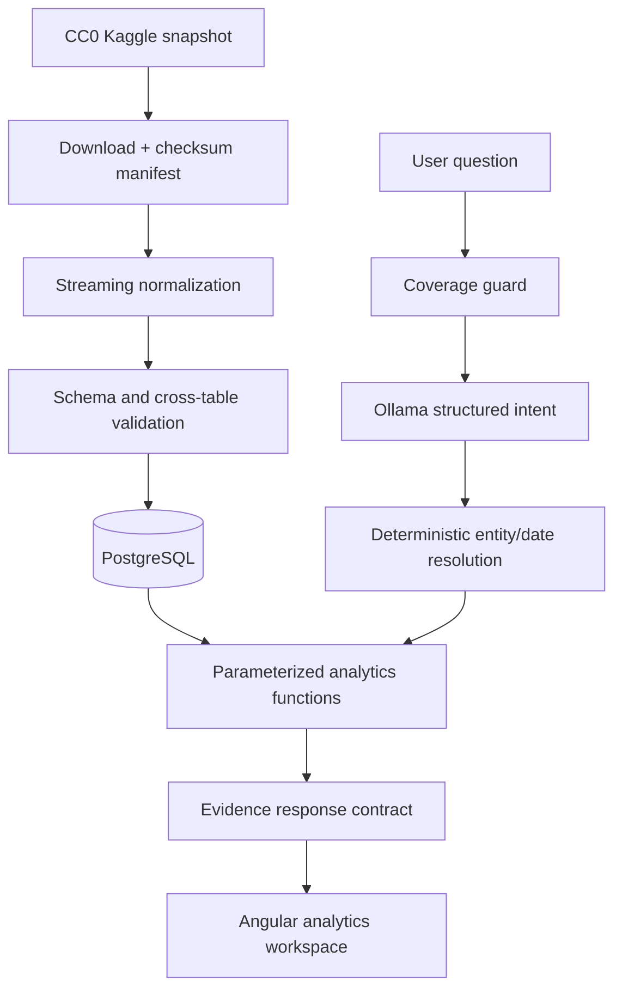

# Architecture

## Scope decision

The relational layer covers the full 2025-26 league, while the product's
default experience focuses on Houston and Kevin Durant. League-wide data is
necessary because every team result depends on an opponent row and because it
keeps future comparisons possible. Play-by-play, video, and tracking data are
outside the current answer contract.

## Answer contract

Every answer exposes:

- `method`: `sql` or `refusal` in the current implementation;
- a concise answer;
- calculation steps for derived statistics;
- supporting game, team, player, or event identifiers;
- the data coverage used;
- a specific missing-data explanation when the answer is unsupported.

The language model does not calculate aggregates or execute arbitrary SQL.
Exact values come from parameterized, tested analytics functions; the model
only selects a supported intent. Known coverage gaps are rejected before the
model is called, and team/player/date resolution is checked against the
database before any analytics function runs.

## Reliability boundaries

- Raw source booleans and mixed minute encodings are normalized explicitly;
  validation reconciles player minutes to team totals within four seconds.
- Each database load uses the validated normalized files and can replace the
  fixed snapshot transactionally.
- The UI shows the canonical filters actually used, rather than untrusted
  intermediate fields returned by the intent model.
- A missing player row is not treated as evidence of an injury. Availability
  reasons are returned only when the source includes a comment.
