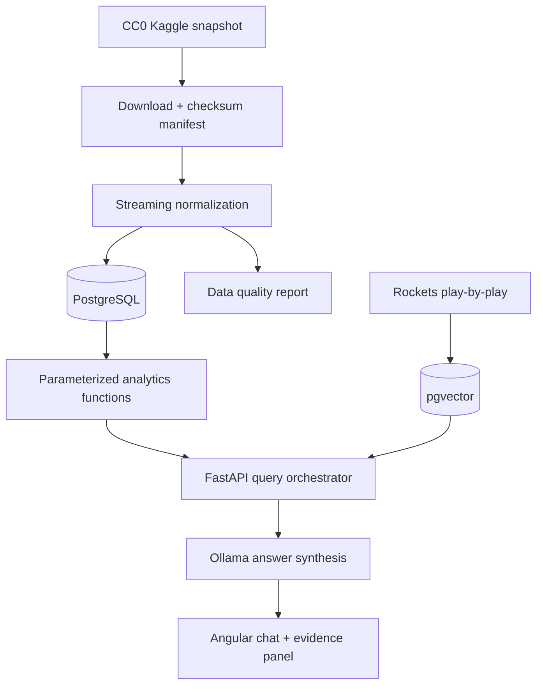

# Architecture

## Scope decision

The relational layer covers the full 2025-26 league, while the product's
default experience and eventual play-by-play retrieval focus on Houston and
Kevin Durant. This preserves league-wide comparisons without creating an
unnecessarily large all-league vector index.

## Answer contract

Every answer will expose:

- `method`: `sql`, `hybrid`, or `refusal`;
- a concise answer;
- calculation steps for derived statistics;
- supporting game, team, player, or event identifiers;
- the data coverage used;
- a specific missing-data explanation when the answer is unsupported.

The language model will not calculate aggregates or execute arbitrary SQL.
Exact values come from parameterized, tested analytics functions; the model
only selects supported tools and explains their verified outputs.
